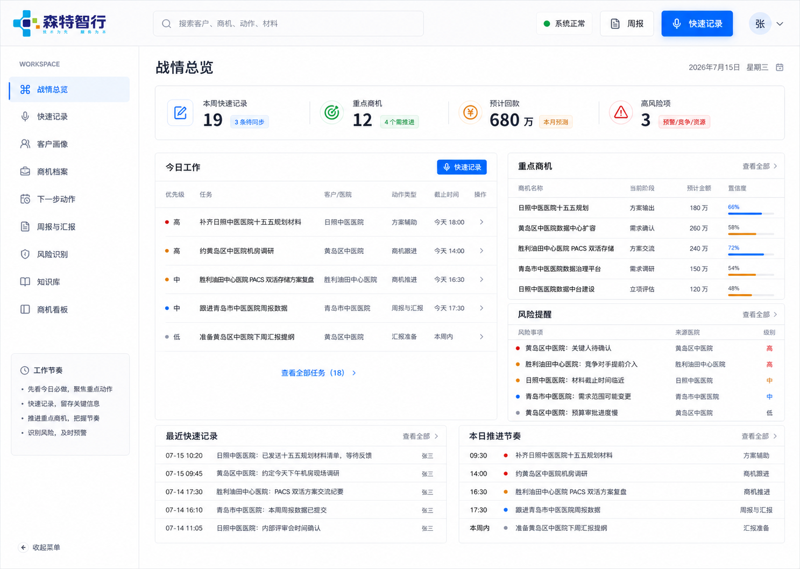
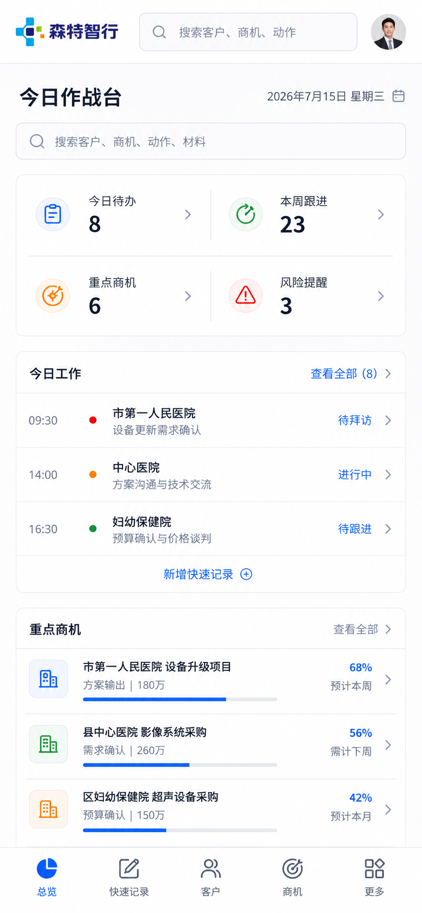

# 森特智行 AI 销售作战台

森特智行 AI 销售作战台是一套面向个人销售作业的轻量业务系统。它不以“大而全 CRM”为目标，而是围绕客户信息、商机推进、沟通记录、AI 提炼、行动跟进、风险识别和周报输出形成闭环。

当前仓库包含 React 前端、Node.js 后端、SQLite 数据库、DeepSeek 分析接入、微信机器人接入基础、部署脚本、测试证据和产品设计资料。

## 当前状态

项目处于 `0.1.0` 发布候选开发阶段。

| 范围 | 状态 | 说明 |
| --- | --- | --- |
| 数据库、安全认证和审计 | 已验证 | 迁移、备份恢复、Cookie 会话、CSRF、乐观锁、软删除和审计已覆盖 |
| 客户、商机、行动、风险、周报 | 已实现 | 使用后端真实数据，不使用演示业务回退 |
| 快速记录和 AI 分析 | 已实现 | 新建默认语音，分析结果持久化并可保存修改 |
| 复杂销售决策 Agent V1 | 已验证 | 商机详情显式诊断、不可变证据快照和只读历史；不自动写回业务档案 |
| URL 路由与浏览器历史 | 开发中 | 路由核心已验证，页面级整合仍需完成验收 |
| 语音资产持久化 | 开发中 | 后端存储与恢复正在完善，前端上传与播放仍需联调 |
| 微信机器人持久化 | 待开发 | 已有接入基础，仍需事件幂等、草稿持久化和单消费者保护 |
| 方案辅助 | 暂缓 | 按产品决策关闭写入，仅保留只读历史入口 |
| 新版生产部署 | 待验收 | 现网旧版本保留，发布候选通过全部门禁后再切换 |

真实进度与下一步计划见 [开发进度与路线图](docs/开发进度与路线图.md)。

## 核心模块

- 总览与管理汇报
- 快速记录、录音和 AI 沟通纪要
- 客户画像
- 商机档案与商机看板
- 复杂型 B2B 销售决策诊断
- 下一步行动
- 智能拜访行程、路线地图和拜访顺序
- 风险识别
- 周报生成与导出
- 销售知识库
- 微信机器人绑定与消息接入
- 方案辅助只读历史

销售决策 Agent V1 作为商机详情中的独立诊断能力运行。它使用短核心提示词、行业 playbook 和严格 JSON 合同，不覆盖快速记录分析；诊断只保存当时的受限输入快照和分析快照，阶段升级、资源投入及客户/商机/动作/风险写回仍需人工确认。正式调整评分权重和阶段门槛前，必须使用真实赢单、输单和暂停案例完成校准。

## 视觉基线

PC 与移动端统一采用 Apple Design 风格一，强调清晰层级、紧凑业务布局、明确操作状态和跨分辨率适配。





## 技术架构

```text
React 19 + Vite
        |
Cookie Session + CSRF + JSON API
        |
Node.js 24 + node:http
        |
SQLite + migrations + audit log
        |
DeepSeek / AMap / WeChat Agent / private voice storage
```

## 本地运行

要求：

- Node.js 24
- npm
- Windows、WSL Ubuntu 24.04 或兼容 Linux 环境

安装依赖：

```bash
npm ci --prefix backend
npm ci --prefix outputs/product-design-prototype
```

根据 [backend/.env.example](backend/.env.example) 创建本机 `backend/.env`。禁止把真实账号、密码、API 密钥或生产地址提交到 Git。

前端高德 JS 配置参考 [outputs/product-design-prototype/.env.example](outputs/product-design-prototype/.env.example)，本机值放在被 Git 忽略的 `.env.local`。浏览器先解析地址，后端用高德 Web 服务逆地理复核并完成路线规划；没有前端 Key 时仍保留后端正向编码兼容路径。

启动完整本地开发栈：

```bash
npm run dev:start
npm run dev:health
```

停止：

```bash
npm run dev:stop
```

## 质量验证

```bash
npm run scan:secrets
npm run test:release
npm --prefix backend test
npm --prefix outputs/product-design-prototype run qa:local
npm --prefix outputs/product-design-prototype run qa:integration
```

`qa:integration` 会启动真实前后端并执行浏览器流程，运行时间和环境要求高于普通单元测试。
在没有 WSL 的 Windows 设备上，集成脚本会自动使用原生 Node 启动隔离后端；设置 `SENT_ZX_EXPECT_AMAP=true SENT_ZX_REAL_ITINERARY=true` 可开启真实高德创建/删除门禁。

## 文档索引

- [原始项目需求书](项目需求书.txt)
- [需求与验收矩阵](docs/需求与验收矩阵.md)
- [升级设计规格](docs/superpowers/specs/2026-07-15-sentelligent-sales-workbench-upgrade-design.md)
- [复杂型 B2B 销售决策 Agent V1 规则](backend/src/ai/agents/sales-decision-agent-v1.md)
- [共享 API 契约](outputs/product-design-prototype/docs/06-shared-api-contract.md)
- [开发进度与路线图](docs/开发进度与路线图.md)
- [开发日志](docs/开发日志.md)
- [变更日志](CHANGELOG.md)
- [正式交付验收手册](docs/正式交付验收手册.md)
- [安全策略](SECURITY.md)
- [协作规范](CONTRIBUTING.md)

## 数据与安全边界

此仓库只保存源码、产品文档、设计基线和脱敏测试证据，不保存：

- `.env` 和任何真实凭据
- SQLite 生产数据库及备份
- 客户原始数据
- 语音录音和微信会话状态
- SSH 私钥、证书和发布压缩包
- `.runtime`、日志、依赖与构建产物

详细要求见 [SECURITY.md](SECURITY.md)。

## 版权

本项目为私有商用项目，不授予公开复制、分发或再许可权利。
