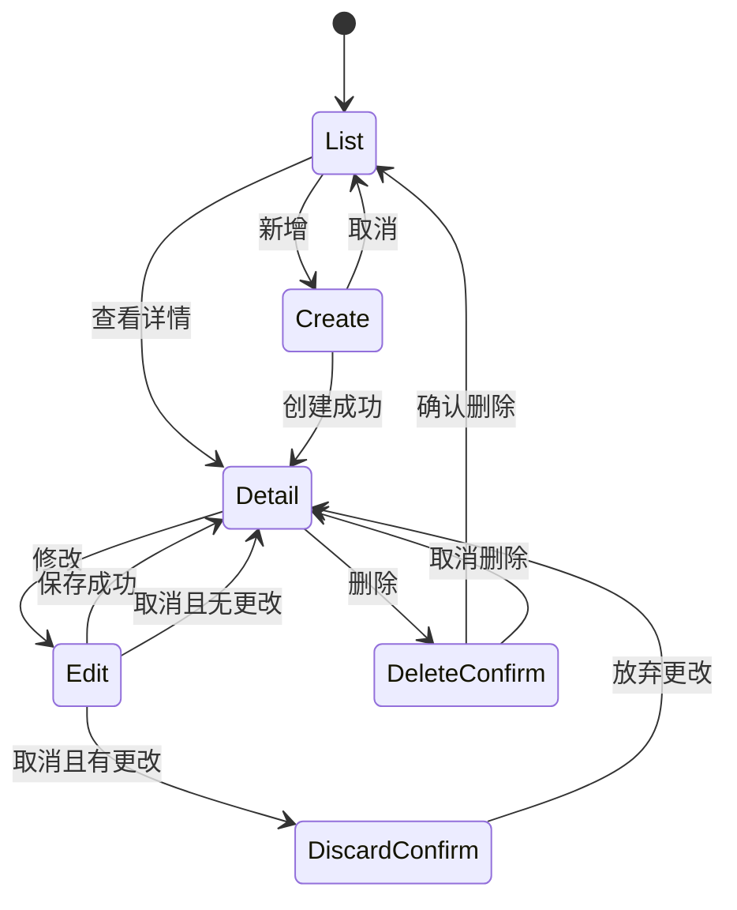
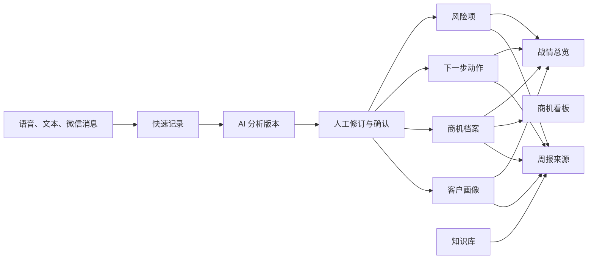

# 森特智行 AI 销售作战台升级设计规格

状态：待用户复核

日期：2026-07-15

适用范围：PC Web、iPhone Safari、Android Chrome、Node.js 后端、SQLite、DeepSeek、语音转写、微信机器人

基线提交：`da1ff72 chore: establish verified project baseline`

## 1. 已确认决策

1. PC 与手机均采用“风格一”，以下两张图是唯一视觉方向基准：
   - `outputs/design-renders/selected/2026-07-15-style-1-desktop.png`
   - `outputs/design-renders/selected/2026-07-15-style-1-mobile.png`
2. 参考图约束视觉密度、层级、导航和信息组织，不覆盖已经确认的业务规则。
3. 不保留全局业务搜索。客户、商机、动作、风险、知识、周报和快速记录分别使用模块内搜索，只查询本模块数据。
4. 所有人工维护对象统一采用“列表 -> 只读详情 -> 明确修改 -> 空白新增 -> 删除确认”模式。查看详情时不能直接编辑。
5. 快速记录默认进入语音模式。打开新记录时必须为空；打开历史记录时直接显示已保存的原文和分析，不自动再次调用模型。
6. AI 结果允许人工修改。确认写回时固定使用用户选定的分析版本，并展示将影响的客户、商机、动作、风险和周报来源。
7. 方案辅助本轮暂缓，不进入主导航和 P0 开发；保留已有数据、API 和兼容路由，不删除现有能力。
8. 本地开发和验证先完成，生产部署后置。发布必须具备源码版本、数据库备份、回退点和重启后健康检查。
9. 本规格通过前不修改业务代码或生产环境。

### 1.1 升级前回退基线

- 备份目录：`C:\Users\50159\Desktop\森特智行版本备份\20260715-075245`
- 源码归档：`source\sentelligent-pre-style1-upgrade.zip`
- 源码 SHA-256：`8979F33288EA5CCFB23902D850877DD562E4B9D3ECE00ACEF7BC9CC6CF92B2EB`
- 数据库备份：`database\2026-07-14T23-53-38-267Z-pre-style1-upgrade.sqlite`
- 数据库 SHA-256：`300C614F334A518D9E700CF08D9B372779DE7632943CE1B97E293CD746B68AA1`
- 数据库已通过 `quick_check`、外键检查、12 张表记录数核对和恢复副本哈希核对。
- 自动化基线：根部署测试 14/14、后端测试 44/44、前端本地 QA 全部通过。

## 2. 产品定位

森特智行不是通用 CRM。它是一套单用户优先的 AI 销售作战台，用来减少销售人员在客户资料、沟通记录、商机推进、风险识别和周报整理之间来回切换的成本。

系统必须持续回答四个问题：

- 客户和商机现在处于什么状态。
- 今天最该推进什么。
- 当前卡点和证据是什么。
- 本周发生了什么，下一步需要谁配合。

### 2.1 使用角色

| 角色 | 主要任务 | 默认入口 |
| --- | --- | --- |
| 销售 | 记录沟通、更新客户和商机、完成动作、生成周报 | 今日作战台、快速记录 |
| 售前支持 | 读取客户背景、需求、风险和知识引用 | 客户详情、商机详情、知识库 |
| 销售经理 | 查看重点商机、风险、阶段分布和资源需求 | 战情总览、风险、周报 |
| 系统所有者 | 管理登录会话、模型状态、微信绑定和备份 | 账号菜单、微信绑定、系统状态 |

当前正式账号仍为单账号，并同时承担销售与系统所有者职责。上表用于约束页面和数据边界，本轮不新增多用户角色管理、多租户、组织架构和复杂审批流；微信机器身份仍必须单独限权。

### 2.2 成功标准

- 用户在手机打开首页后，不滚动即可看到 4 个关键指标和至少 3 条今日工作。
- 新增客户、商机、动作、风险和知识时直接进入空白表单，不显示上一条记录。
- 任何详情默认只读；只有点击“修改”后才出现表单控件。
- 所有写操作刷新页面和重启服务后仍保持一致。
- 快速记录从录音或文字到 AI 分析、人工修订、确认写回形成可追溯链路。
- 任何按钮都有可观察结果，不存在只改变样式、不改变数据或状态的“样子货”。

## 3. 范围与非目标

### 3.1 本轮范围

- 登录和七天会话。
- 战情总览。
- 快速记录、录音、实时转写、上传转写、历史记录和分析版本。
- 客户画像。
- 商机档案。
- 下一步动作。
- 周报与汇报。
- 风险识别。
- 销售知识库。
- 商机看板。
- 微信机器人绑定与消息草稿持久化。
- DeepSeek 分析、提炼和建议能力。
- 审计、备份、迁移、发布、回退和监控。

### 3.2 暂缓范围

- 方案辅助的新设计和功能增强。
- 多租户、复杂角色权限、审批流、报价、合同、回款和发票。
- 邮件、企业微信、钉钉等新渠道。
- 知识库向量检索、OCR 和大型附件管理。
- 原生 iOS 或 Android 应用。

暂缓不等于删除。现有方案草稿表和历史数据保留。账号菜单的“历史方案”提供 `/solutions` 列表和 `/solutions/:id` 只读详情，不进入 PC 主导航或手机“更多”。只读 GET 接口继续使用；已有生成和修改接口保留兼容路径，但生产默认由 `SOLUTION_WRITES_ENABLED=false` 关闭并返回 `403 FEATURE_DISABLED`，不得调用本轮新增 AI 能力。验收必须证明历史方案可打开、迁移前后数量与内容哈希一致、页面没有新增/修改/生成入口且不会发起模型请求。

## 4. 信息架构与导航

### 4.1 PC

PC 使用固定工作台结构：

- 顶部工具栏固定，包含品牌、当前模块上下文、系统状态、周报入口、快速记录和账号菜单。
- 左侧导航固定，宽度 `232px` 至 `248px`，支持收起到 `64px` 图标栏。
- 主内容区是唯一业务滚动容器。浏览器页面本身不因长数据无限增长。
- 搜索、筛选、批量动作放在当前模块标题下方，不放在全局顶栏。
- 详情优先使用右侧 Drawer；复杂编辑使用独立页面或全宽 Drawer，避免卡片内再套卡片。

PC 主导航顺序：

1. 战情总览
2. 快速记录
3. 客户画像
4. 商机档案
5. 下一步动作
6. 周报与汇报
7. 风险识别
8. 知识库
9. 商机看板

微信绑定进入账号菜单或“更多工具”。方案辅助保留兼容入口，不占主导航。

### 4.2 手机

手机使用独立任务优先布局，不缩放 PC 侧栏：

- 顶部 App Bar 高 `56px`，含安全区。显示品牌图标、当前页面标题和账号头像。
- 页面标题、日期和模块内搜索位于内容区。
- 固定底部导航包含 5 项：总览、快速记录、客户、商机、更多。
- “更多” Bottom Sheet 承载动作、周报、风险、知识、看板和微信绑定。
- 底部导航区域包含 `env(safe-area-inset-bottom)`，正文预留相同高度。
- 只有商机看板内部允许横向滚动，页面、导航和普通列表禁止横向溢出。

### 4.3 URL 与返回行为

页面状态必须进入 URL，支持刷新、浏览器后退和深链接。目标路由如下：

| 对象 | 列表 | 新增 | 详情 | 修改 |
| --- | --- | --- | --- | --- |
| 快速记录 | `/quick-records` | `/quick-records/new` | `/quick-records/:id` | `/quick-records/:id/edit` |
| 客户 | `/customers` | `/customers/new` | `/customers/:id` | `/customers/:id/edit` |
| 商机 | `/opportunities` | `/opportunities/new` | `/opportunities/:id` | `/opportunities/:id/edit` |
| 动作 | `/actions` | `/actions/new` | `/actions/:id` | `/actions/:id/edit` |
| 周报 | `/weekly-reports` | `/weekly-reports/new` | `/weekly-reports/:id` | `/weekly-reports/:id/edit` |
| 风险 | `/risks` | `/risks/new` | `/risks/:id` | `/risks/:id/edit` |
| 知识 | `/knowledge` | `/knowledge/new` | `/knowledge/:id` | `/knowledge/:id/edit` |

总览为 `/overview`，看板为 `/opportunities/kanban`，微信绑定为 `/settings/weixin`。未保存编辑返回时必须提示“放弃更改”，只读详情返回时直接回到原列表位置和筛选条件。

## 5. Apple Design 视觉系统

### 5.1 视觉原则

- 安静、克制、工作优先，不使用营销式 Hero。
- 用字重、间距、分组和分隔线建立层级，颜色只表达动作和状态。
- 页面区段不做漂浮卡片；卡片只用于指标组、重复条目、Modal、Drawer 和工具面板。
- 圆角不超过 `8px`。不使用大圆角胶囊承载普通文字命令。
- 不使用装饰渐变、发光、彩色光球或厚重阴影。
- 图标统一使用 Lucide，优先使用熟悉图标并提供 tooltip 或可访问名称。

### 5.2 设计 Token

```css
:root {
  --font-ui: -apple-system, BlinkMacSystemFont, "SF Pro Text", "PingFang SC", "Microsoft YaHei", sans-serif;
  --color-canvas: #f5f5f7;
  --color-surface: #ffffff;
  --color-surface-secondary: #f2f2f7;
  --color-text: #1d1d1f;
  --color-text-secondary: #6e6e73;
  --color-text-tertiary: #8e8e93;
  --color-divider: rgba(60, 60, 67, 0.18);
  --color-accent: #007aff;
  --color-success: #34c759;
  --color-warning: #ff9500;
  --color-danger: #ff3b30;
  --color-info: #5856d6;
  --radius-sm: 4px;
  --radius-md: 6px;
  --radius-lg: 8px;
  --shadow-popover: 0 12px 32px rgba(0, 0, 0, 0.12);
  --space-1: 4px;
  --space-2: 8px;
  --space-3: 12px;
  --space-4: 16px;
  --space-5: 20px;
  --space-6: 24px;
  --space-8: 32px;
}
```

状态浅色背景由系统色按 `8%` 至 `12%` 透明度生成，不再扩展大批同色系装饰颜色。

### 5.3 字体

| 用途 | PC | 手机 | 字重 |
| --- | --- | --- | --- |
| 页面标题 | `28px/36px` | `28px/36px` | 650 或 700 |
| 区段标题 | `18px/26px` | `20px/28px` | 600 |
| 卡片标题 | `15px/22px` | `16px/24px` | 600 |
| 正文 | `14px/22px` | `16px/24px` | 400 |
| 辅助文字 | `12px/18px` | `13px/19px` | 400 |
| 指标数字 | `28px/34px` | `30px/36px` | 650 |

字体不随视口宽度缩放，字距固定为 `0`。长名称优先换行，两行后省略并提供完整 title，不压缩到不可读字号。

### 5.4 控件与状态

- PC 普通按钮高 `36px`，主操作高 `40px`。
- 手机所有触控目标最小 `44 x 44px`。
- 主操作使用系统蓝底白字；次操作使用浅灰背景；危险操作使用红色文字或红色确认按钮。
- 输入框默认高 `40px`，手机 `44px`；聚焦使用 `2px` 半透明蓝色外环。
- 禁用态保持文字可读，同时禁止 pointer 和键盘触发。
- 表格 PC 行高 `44px` 至 `48px`；手机改为分组列表行，不横向压缩表格。
- 承载业务对象的卡片或列表行必须进入详情、展开证据或执行明确命令。纯展示指标不伪装成可点击卡片，不显示 hover、手型指针或箭头。
- Loading 使用固定尺寸骨架，禁止加载前后布局跳动。
- 空状态只说明当前结果和可执行动作，不放产品功能说明。
- 错误状态保留用户输入，提供“重试”或“返回”，并显示请求 ID。
- 命令触发后立即进入提交态，并在 2 秒内给出成功、失败或持续处理反馈；同一次点击只产生一次路由变化或请求。

### 5.5 动效

- 页面层级切换使用 `160ms` 至 `220ms` 的淡入和位移。
- Drawer 从右侧进入，Sheet 从底部进入；不使用弹跳装饰。
- 保存成功不移动布局，只显示轻量反馈并更新只读详情。
- 支持 `prefers-reduced-motion: reduce`，关闭非必要位移动画。

## 6. 响应式布局

### 6.1 PC 100% 缩放

| 视口 | 目标布局 |
| --- | --- |
| `1366 x 768` | 侧栏 `216px`，内容两列，主区内部滚动，不出现页面横向滚动 |
| `1440 x 900` | 侧栏 `232px`，按风格一完整显示 KPI 带、今日工作、商机和风险 |
| `1920 x 1080` | 内容最大宽度 `1640px`，增加列宽和留白，不放大字体 |
| `1024 x 768` | 收起侧栏或使用窄图标栏，表格保留主要列，次要信息进入详情 |

`body` 边距为 `0`。桌面壳层最多保留 `6px` 外边距和 `8px` 圆角；小于等于 `1366px` 或移动端取消外边距，避免浏览器四周出现白圈。

### 6.2 手机与平板

- 手机断点为 `max-width: 767px`，目标宽度 `360px` 至 `430px`。
- 平板 `768px` 至 `1023px` 使用紧凑侧栏或分栏，不使用手机底部栏和 PC 全宽表格的混合形态。
- 使用 `100dvh`，并对不支持动态视口的浏览器回退到 `100vh`。
- 正文宽度始终小于等于视口；长 ID、URL 和文件名允许断行。
- iPhone 横竖屏切换后重新计算安全区和可视高度，不保留错误的固定高度。

## 7. 统一业务交互模型

### 7.1 状态机



### 7.2 通用规则

1. 列表只展示扫描所需信息，整行可选择，但“查看详情”保留清晰动作名称。
2. 详情只读，字段值不是输入框。修改和删除放在固定操作区。
3. 新增永远从空白模型开始，不能继承当前选中对象。
4. 编辑只修改当前对象；取消不写 API、不改变列表数据。
5. 删除使用系统内确认 Dialog，展示对象名称和关联影响，不调用 `window.confirm`。
6. 保存期间禁用重复提交。失败时保留表单、滚动到错误摘要并聚焦首个错误字段。
7. 所有 PATCH 携带 `version`。旧版本返回 `409 CONFLICT`，用户选择重新加载或复制本地内容。
8. 删除默认软删除。恢复和彻底清理由后台维护流程处理。
9. 列表搜索、筛选、排序和滚动位置在详情返回后恢复。

## 8. 模块设计

### 8.1 战情总览

桌面结构遵循风格一：

1. 页面标题、日期和轻量日期选择器。
2. 一体化 KPI 指标带：本周快速记录、重点商机、预计回款、高风险项。
3. 左侧今日工作表，右侧重点商机和风险提醒。
4. 下方最近快速记录和本日推进节奏。

手机结构遵循风格一：

1. 今日作战台和日期。
2. 单个 `2 x 2` KPI 分组面板。
3. 至少 3 条今日工作，并提供新增快速记录。
4. 至少 3 条重点商机。
5. 固定底部导航。

所有 KPI、任务行、商机行、风险行和最近记录均携带真实对象 ID。点击后进入对应列表筛选或对象详情，不只改变选中样式。

### 8.2 快速记录

#### 新记录

- 默认路由 `/quick-records/new`，默认模式“语音”。
- 顶部只保留“语音 / 文本”分段控制和当前录入状态。
- 主操作为开始转写。录音中显示计时、暂停、继续和停止。
- 支持两条路径：浏览器实时识别；浏览器不支持时使用 MediaRecorder 录音上传后端转写。
- 转写文本实时进入可编辑文本区。停止后允许校对，再点击“保存并分析”。
- 文本模式只展示必要字段：发生时间、客户或商机可选关联、正文。

#### 历史记录

- “新记录”和“历史记录”是两个明确子视图，避免一张长页面同时塞入录入和全部历史。
- 历史列表支持本模块搜索、日期和来源筛选。
- 打开历史记录时读取已保存原文、音频状态、分析版本和确认结果，不自动调用模型。
- “修改分析”创建人工修订版本；“重新分析”是独立命令，需明确确认并产生新 AI 版本。
- 当前采用哪个版本写回必须可见。已确认版本不可覆盖，只能生成后续修订。
- 已确认记录或分析版本支持“作废确认”。作废必须填写原因并写审计，未来 AI 汇总和周报草稿排除该来源；已经定稿的周报不被静默重写，来源面板显示其后来已作废。
- 作废不自动回滚客户、商机、动作或风险，避免覆盖之后的人工修改。系统展示下游影响清单；仅当派生动作或风险仍保持确认时的版本且没有其他来源时，允许用户在独立确认后归档，其他字段必须通过正常修改流程纠正。

#### 分析与确认

固定分析结构：客户诉求、明确事项、风险点、待办动作、情绪倾向、候选客户、候选商机、建议写回字段。

确认前展示差异预览：

- 将更新哪些客户字段。
- 将更新哪个商机及阶段、需求或下一步。
- 将新增或更新哪些动作。
- 将新增或更新哪些风险。
- 是否加入本周周报来源。

用户可逐项取消。一次确认在同一数据库事务中完成，重复点击或网络重试不得产生重复记录。

### 8.3 客户画像

- 列表列：客户名称、行业或类型、区域、等级、负责人、关联商机数、最近更新。
- 搜索范围：客户名称、联系人、摘要、需求；不查询其他模块。
- 详情分组：基本信息、关键联系人、决策链、历史项目、基础架构、需求与痛点、预算节奏、关联商机、来源记录。
- 手机详情使用 iOS 分组列表和可折叠区段，避免每个字段一张大卡。
- 新增打开空表单；保存后进入新客户只读详情。
- 删除确认显示关联商机和来源数量。存在活动商机时默认禁止删除，允许先归档。

### 8.4 商机档案

- 列表列：商机名称、客户、阶段、金额、赢率、负责人、预计时间、风险数、下一步。
- 搜索范围：商机名称、当前商机已关联的客户名称、需求、竞品、负责人。客户名称是商机索引中的关联展示字段，不代表跨模块全局搜索。
- 详情分组：概览、需求、竞争、方案方向、关键联系人、阶段时间线、动作、风险、来源记录。
- 新增先选择客户，再进入空商机表单；不能把前一个商机数据带入。
- 阶段、金额、赢率和预计日期使用结构化字段，不保存为展示字符串。
- 阶段变化同时更新看板、总览指标和审计日志。
- 删除确认展示动作、风险、快速记录和周报引用影响。

### 8.5 下一步动作

- 列表列：优先级、任务、客户或商机、动作类型、负责人、截止时间、状态。
- 支持系统生成和手工新增。手工新增进入空表单。
- 详情显示生成原因、来源证据、关联对象和状态历史。
- 修改支持标题、负责人、截止时间、优先级、状态和备注。
- “写入本周计划”必须创建周报来源引用，并使用幂等键防止重复写入。
- 完成、延期和取消均记录原因；失败时不提前改变列表状态。

### 8.6 周报与汇报

- 默认显示历史周报列表，不生成假正文。
- 新增先选择周期和数据范围，再明确点击“生成草稿”。
- 草稿按重点进展、商机变化、风险、下周动作和资源协调组织。
- 每段提供来源入口，可回到快速记录、商机、动作或风险。
- AI 草稿默认只读；点击“修改”后进入编辑，并保留原始生成版本。
- 定稿后冻结版本。后续修改创建新版本，不覆盖已导出的版本。
- Word 导出通过受保护的 POST 或同源下载票据返回 Blob，不把登录 token 放入 URL。
- “管理汇报”是同模块的只读汇总视图，展示重点商机、预计回款、阶段变化、高风险项和需要协调的资源，并可钻取到原始对象。当前单账号版本汇总本人盘面，未来多角色版本再扩展团队范围。

### 8.7 风险识别

- 列表列：级别、风险事项、客户或商机、证据、负责人、截止时间、状态。
- 空状态区分“尚未诊断”和“已诊断但无风险”。
- 支持来源生成和手工新增。
- 详情显示风险分值、证据、建议动作、来源版本和处理历史。
- 修改支持负责人、截止时间、状态、处理意见和延期原因。
- “重新诊断”明确调用 AI，并生成新诊断版本，不覆盖已处理风险。

### 8.8 销售知识库

- 列表列：标题、分类、标签、来源、引用次数、更新时间。
- 搜索只查询知识标题、标签、摘要和正文。
- 详情只读，显示内容、版本、来源和被哪些草稿引用。
- 新增和修改使用空白或当前对象编辑器。
- 删除前展示引用影响。已被定稿周报或方案引用时只能归档，不能硬删除。
- 本轮保留文本知识和基础来源，不新增向量库与大型附件管线。

### 8.9 商机看板

- 阶段固定为线索、初步沟通、方案交流、预算确认、招采推进、合同阶段、丢单或暂停。
- PC 支持按钮移动或拖拽；移动端使用“变更阶段”Sheet，避免手势冲突。
- 阶段更新使用真实 PATCH、版本号和审计记录。
- 请求失败时卡片回到原列。首尾阶段不可继续前进或后退。
- 看板内部可横向滚动，页面和底部导航保持固定。

### 8.10 微信机器人绑定

- 页面状态：未绑定、二维码生成中、等待扫码、已扫码待确认、已绑定、已过期、异常、已解绑。
- 二维码仅在用户点击“生成二维码”后创建，显示过期倒计时和重新生成按钮。
- 过期二维码不可复用；解绑后立即撤销机器凭据。
- 绑定账号、最后心跳、最近消息时间和错误原因持久化。
- 消息草稿、外部消息 ID 和处理结果持久化；重启后可恢复未完成草稿。
- 同一外部消息只处理一次。没有稳定会话 ID 的消息不得混入其他对话。
- 微信机器人只允许记录、查询客户和生成周报草稿，不获得通用删除和系统管理权限。

### 8.11 登录与账号菜单

- 登录页延续风格一：品牌、单一表单、明确错误，不使用营销文案。
- 成功后创建七天服务端会话；前端不保存长期 Bearer token。
- 账号菜单包含当前账号、会话到期时间、微信绑定、退出登录。
- 退出立即撤销当前会话并返回登录页。
- 登录配置缺失时服务启动失败，业务 API 不得默认放行。

## 9. 业务数据闭环



每个派生对象必须保留 `source_type`、`source_id` 和 `source_revision_id`。UI 中所有“AI 建议”“来自快速记录”“进入周报”等标记都能打开对应来源。

## 10. 前端目标架构

现有 `App.jsx`、`pages.jsx` 和 `global.css` 过大，先进行无行为变化拆分，再允许并行开发。目标边界：

```text
src/
  app/
    AppShell.jsx
    WorkbenchRouter.jsx
    useWorkbenchController.js
  components/
    ui/
    navigation/
    feedback/
  features/
    overview/
    quickRecord/
    customers/
    opportunities/
    actions/
    weekly/
    risks/
    knowledge/
    kanban/
    weixin/
  api/
  auth/
  styles/
    tokens.css
    foundations.css
    shell.css
    responsive.css
```

架构规则：

- 路由是页面模式和选中对象的唯一来源，不再维护多组可能漂移的 `viewMode`。
- API 数据、空数组和加载状态分开表达。后端返回空数组时显示真实空状态，不能回填演示数据。
- Seed 数据只用于明确的开发演示环境，生产和正式验收默认关闭。
- 共享 UI 组件不依赖业务数据文件；业务数据文件不导入图标组件。
- 每个 feature 拥有页面、表单适配、局部样式和测试，不修改其他 feature 文件。
- `package.json`、路由、Token、共享 API 契约和公共组件由主控统一维护。

## 11. 后端目标架构

```text
backend/src/
  app/
  auth/
  http/
  validation/
  migrations/
  repositories/
  services/
  ai/
  voice/
  weixin/
  audit/
```

- `http` 负责路由、请求 ID、大小限制、错误映射和响应格式。
- `validation` 负责字段白名单、类型、长度、枚举和外键校验。
- `repositories` 负责 SQL，不包含 HTTP 或模型调用。
- `services` 负责事务、幂等和跨对象业务规则。
- `ai` 负责脱敏、提示词、模型调用、解析、版本和观测。
- `voice` 负责上传、存储、转写任务、清理和状态机。
- `weixin` 负责绑定、事件去重、草稿持久化和权限收敛。
- `audit` 与业务写入处于同一事务。

现有 `server.js` 只作为迁移入口。拆分期间只能由单一基础 Agent 修改，避免多人同时改动同一个大文件。

## 12. 数据库与迁移

### 12.1 SQLite 运行设置

- `PRAGMA foreign_keys = ON`
- `PRAGMA journal_mode = WAL`
- `PRAGMA busy_timeout = 5000`
- `PRAGMA synchronous = NORMAL`
- 服务启动执行 `quick_check` 和迁移版本检查。

### 12.2 目标表与字段

保留现有 12 张表和 ID，增加：

- `schema_migrations`：迁移版本、校验和、执行时间。
- `users`、`sessions`：账号、密码哈希、会话摘要、到期和撤销时间。
- `ai_analysis_revisions`：记录 ID、输入哈希、模型、提示词版本、来源、输出、耗时、用量、错误和创建者。
- `voice_assets`、`transcription_jobs`：文件元数据、任务状态、结果、保留期限和清理状态。
- `weixin_bindings`、`weixin_events`、`weixin_conversation_drafts`：绑定、外部事件去重和草稿恢复。
- `entity_revisions` 或各实体 `version`：乐观并发控制。

现有业务表增加 `version INTEGER NOT NULL DEFAULT 1`、`deleted_at`、必要枚举和 JSON 有效性约束。金额改为最小货币单位整数，日期使用 ISO 8601，展示格式由前端处理。

### 12.3 事务与幂等

- 快速记录确认、客户或商机同步、动作和风险生成、审计写入必须在一个事务中提交或回滚。
- 创建和 AI 触发接口接受 `Idempotency-Key`。相同账号、接口、key 和请求摘要在 24 小时内返回首次结果；相同 key 对应不同请求摘要时返回 `409`。
- 外部微信消息使用平台消息 ID 作为去重键。
- AI 分析按输入哈希、提示词版本和模型版本识别重复请求；用户明确重新分析时生成新版本。
- 更新和删除既有可变实体使用 `version`，成功后递增。创建、AI 触发和首次接收微信事件尚无既有实体版本，只使用幂等键。
- 快速记录确认携带所有目标客户、商机及相关派生对象的当前版本；任一版本冲突时整笔事务返回 `409` 并全部回滚。

### 12.4 删除与审计

- 客户、商机、动作、风险、知识和周报使用软删除。
- 审计记录包含认证主体、请求 ID、动作、对象、前后差异、结果和时间。
- 密钥、会话、原始音频内容和敏感联系人字段不写入日志。
- 审计失败导致业务事务回滚，不能出现业务已改而日志缺失。

## 13. API 契约

### 13.1 统一响应

成功响应：

```json
{
  "data": {},
  "meta": { "requestId": "req_xxx" }
}
```

错误响应：

```json
{
  "error": {
    "code": "VALIDATION_ERROR",
    "message": "提交内容有误",
    "fields": { "name": "客户名称不能为空" },
    "requestId": "req_xxx"
  }
}
```

生产响应不返回 SQL、文件路径、堆栈和供应商原始错误。共享契约覆盖请求、响应、错误、枚举和分页，不只校验实体形状。

### 13.2 HTTP 规则

- 请求体默认上限 `1MB`；音频使用独立上传接口和更严格 MIME、扩展名、时长、大小校验。
- 列表使用分页、模块内搜索和稳定排序。
- 所有写操作校验 `Origin`、CSRF token 和会话；更新或删除既有可变实体额外校验实体版本。
- 下载使用同源受保护请求，不接受 URL token。
- CORS 只允许正式前端域名和本地开发地址，不使用 `*`。

## 14. 认证与安全

### 14.1 会话

- 密码使用 `scrypt` 或 `argon2id` 哈希，不以环境变量明文参与会话签名。
- 登录成功创建随机 256 位会话 token，服务端只保存摘要。
- Cookie 设置 `HttpOnly`、`Secure`、`SameSite=Lax`、限定 Path 和七天到期。
- 状态写请求同时验证 CSRF token 和同源 `Origin`。
- 退出、密码变更和管理员撤销会立即失效会话。

### 14.2 防护

- 登录按 IP 和账号限流，连续失败增加等待时间。
- 机器令牌只允许明确的微信能力，不能访问审计、删除和系统设置。
- 禁止 query token。
- 设置 CSP、`X-Content-Type-Options`、`Referrer-Policy`、HSTS 和 frame 限制。
- 二维码内容不通过未净化的 `dangerouslySetInnerHTML` 注入；优先使用受信任二维码库生成 Canvas 或图片。
- 所有秘密只放服务器环境文件，权限限制为服务账号可读。

## 15. DeepSeek 设计

### 15.1 调用边界

- 模型名称由后端配置，默认使用已确认的 `DeepSeek-V4-Flash` 配置项，不写死在前端。
- 前端只调用业务 API，不接触供应商密钥、Base URL 和原始模型响应。
- 模型只生成建议和草稿，不能直接执行删除、阶段推进或最终确认。

### 15.2 数据最小化

发送模型前按用途建立字段白名单：

- 用内部占位符替换联系人姓名、电话、微信号和邮件。
- 默认不发送完整客户对象、预算明细、决策链和无关历史。
- 原始文本按任务所需截取，并在响应回写前恢复可用引用。
- 保存出站字段清单和输入哈希，不保存可复原的敏感请求正文到普通日志。

### 15.3 版本与可观测

每次调用记录：

- 业务类型和对象 ID。
- 模型和提示词版本。
- 输入哈希和脱敏策略版本。
- 开始时间、耗时、结果来源、重试次数。
- token 或计费用量（供应商提供时）。
- 成功、超时、限流、解析失败或规则降级。

UI 显示“DeepSeek 分析”“规则降级”或“人工修订”，不把降级结果伪装成模型结果。

### 15.4 容错

- 只对网络错误、`429` 和可重试 `5xx` 使用指数退避和抖动，最多 2 次。
- 单次请求超时由业务类型配置，快速记录默认 30 秒。
- JSON 解析失败不写入正式确认版本，保留原文并允许重试。
- 连续失败触发短时熔断；健康接口只暴露 ready 和最近成功时间，不暴露密钥或提示词。

## 16. 语音转写设计

### 16.1 浏览器能力

- HTTPS 是生产环境语音入口的前提。
- Chrome/Android 优先使用浏览器实时识别；不可用时自动切换录音上传。
- iPhone Safari 以 MediaRecorder 录音上传为可靠路径，浏览器支持实时识别时再增强。
- 权限拒绝、设备缺失、录音中断和页面切后台都提供明确恢复动作。

### 16.2 服务端接口

1. `POST /api/voice/assets` 创建受限上传。
2. `POST /api/voice/transcriptions` 创建幂等转写任务。
3. `GET /api/voice/transcriptions/:id` 查询状态和结果。
4. 转写成功后由用户校对，再创建快速记录。

校验包含 MIME、文件头、大小、时长和空音频。失败文件按策略清理；成功音频默认保留 30 天，可由用户立即删除或在系统设置中缩短保留期。文件名、路径和供应商错误不返回前端。

### 16.3 任务状态

`uploaded -> queued -> processing -> completed | failed | expired`

任务和快速记录之间保留稳定引用。刷新、断网或服务重启后可以继续查询，不要求用户重新录音。

## 17. 微信持久化设计

- 绑定凭据保存在独立运行目录，权限限制为服务账号。
- 应用数据库保存绑定状态、过期时间、最后心跳和 SDK 会话引用，不保存可直接展示的秘密。
- 对话草稿持久化并设置 24 小时 TTL；过期后安全清理。
- 消息处理采用“接收事件 -> 去重 -> 写入草稿或业务命令 -> 记录结果”流程。
- 创建快速记录和触发分析使用同一个业务幂等键，避免分析失败后重试产生第二条记录。
- 后端、微信 worker 和前端静态服务分别受进程管理器监督，服务器重启后自动启动。
- 每个服务使用独立端口、运行目录、日志目录和 systemd 单元，不覆盖服务器其他项目。

微信事件状态固定为 `received -> drafting -> ready -> processing -> completed | failed_recoverable | expired`。重启恢复规则：

- 未过期的 `awaiting_scan` 绑定继续等待扫码；已过期二维码进入 `expired`，必须重新生成。
- `drafting` 和 `ready` 草稿从数据库恢复，继续等待用户补充或确认。
- 重启时处于 `processing` 的事件改为 `failed_recoverable`，worker 使用相同外部消息 ID 和幂等键重试；不得创建第二条快速记录。
- `completed` 事件永不重放；重复收到相同外部消息 ID 时返回首次处理结果。
- 解绑后撤销凭据，任何遗留草稿只能在系统内查看或作废，不能继续通过原微信会话提交。

## 18. 错误、空状态与恢复

| 场景 | UI 行为 | 数据行为 |
| --- | --- | --- |
| API 离线 | 顶部显示连接异常，写按钮保留输入并提供重试 | 不写本地假数据冒充成功 |
| 空数据库 | 显示真实空状态和新增入口 | 不注入演示客户或商机 |
| `401` | 返回登录并保留安全的目标路由 | 不继续重试写请求 |
| `409` | 显示版本冲突和重新加载选项 | 不覆盖新版本 |
| `413` | 提示文件过大和限制 | 不保留未登记临时文件 |
| `422` | 字段级错误与摘要 | 事务不开始 |
| AI 超时 | 保留原始记录，显示重试或规则分析 | 不生成伪造成功版本 |
| 数据库锁定 | 短暂重试后返回可恢复错误 | 不产生部分写入 |
| 二维码过期 | 禁用旧码并显示重新生成 | 旧绑定请求失效 |
| 录音中断 | 保留已录片段并允许上传或放弃 | 临时文件按策略清理 |

## 19. 性能与可访问性目标

### 19.1 性能

- 正式构建首屏脚本压缩后目标小于 `350KB`，单模块按需加载。
- 4G 模拟和中端手机的 LCP P75 小于等于 `2.5s`，INP P75 小于等于 `200ms`，CLS 小于等于 `0.1`。
- 本地或同机房普通列表 API 的 `p95` 小于 `300ms`。
- 普通写 API 的 `p95` 小于 `500ms`，不含外部 AI 和转写；非 AI API 错误率低于 `0.1%`。
- AI 业务调用 `p95` 小于 `15s`，失败率低于 `1%`，单次硬超时仍为 `30s`。
- 列表超过 100 条后使用分页；不得一次渲染全部历史数据。
- AI 和转写使用明确进度，不阻塞其他模块浏览。

### 19.2 可访问性

- 目标达到 WCAG 2.2 AA。
- 正文和控件文字对比度不低于 `4.5:1`，大字不低于 `3:1`。
- 键盘可完成登录、导航、搜索、查看、修改、保存、取消和 Dialog 操作。
- Dialog 打开后锁定焦点，关闭后返回触发按钮。
- 图标按钮有可访问名称，状态变化使用适度的 live region。
- 错误不只依赖颜色，风险级别同时显示文字和图标。
- 自动化 axe 检查不得出现 `critical` 或 `serious` 问题，关键流程还需使用屏幕阅读器人工验收。

### 19.3 日志、指标与告警

- 指标包含请求量、P50/P95/P99、5xx、认证失败、SQLite 锁等待、备份结果、AI 耗时和失败、微信 worker 心跳、转写失败和麦克风拒绝率。
- 5xx 超过 `1%` 持续 5 分钟、健康检查连续 3 次失败、备份失败 1 次、微信心跳连续失败 3 次或证书剩余不足 30 天时告警。
- 业务审计默认保留 180 天；运行日志按大小和日期轮转，不记录密码、密钥、token、Authorization、完整音频或完整模型提示词。
- DeepSeek 发布探针只使用固定的无客户数据测试提示词，响应必须通过 JSON Schema，日志不得包含密钥和完整请求正文。

## 20. 测试与验收设计

每份候选版本证据必须包含版本号、Git SHA、环境、执行人、UTC 时间、原始日志、截图或录屏，以及涉及后端请求时的请求 ID。当前基线报告只能证明升级前状态，不能替代候选版本验收。

### 20.1 测试层级

1. 单元测试：表单适配、状态机、校验、脱敏、幂等和版本比较。
2. 仓储与服务测试：SQLite 迁移、事务回滚、约束、并发和审计。
3. API 契约测试：请求、响应、错误、认证、限流和权限。
4. 组件测试：列表、详情、编辑、Dialog、Drawer、Sheet 和空状态。
5. 浏览器端到端：每个模块的主流程、异常流程和刷新持久化。
6. 视觉验收：参考尺寸截图、几何约束、溢出和像素对照。
7. 生产探针：登录、只读查询、隔离写入、AI、语音、微信心跳和重启恢复。

### 20.2 每个对象的必测矩阵

快速记录历史、客户、商机、动作、周报、风险和知识都必须覆盖：

- 列表加载、空状态、模块内搜索、无结果。
- 查看详情时不存在表单控件。
- 修改、取消、脏数据放弃确认、保存成功、保存失败。
- 新增打开空白表单、取消、新增成功、重复提交。
- 删除取消、删除确认、关联阻断、刷新后状态。
- 两窗口并发编辑返回 `409`。
- API 失败不乐观改变 UI。
- 使用相同关键词分别创建快速记录、客户、商机、动作、风险和知识夹具；进入任一模块搜索时只返回当前模块对象，不能混入其他类型结果。

快速记录额外覆盖：权限拒绝、实时转写、上传转写、超限、空音频、切后台、刷新恢复、人工修订、不自动重分析、重复确认幂等、作废确认、下游影响预览、已定稿周报来源标记和五类写回一致性。

数据与故障测试额外覆盖：

- 50 个相同幂等键并发请求只产生 1 次业务写入。
- 20 个不同写请求在 5 秒内得到成功或可解释冲突，不出现 `SQLITE_BUSY`、500 或数据库损坏。
- 在快速记录确认的每个数据库步骤注入故障，验证客户、商机、动作、风险和审计全部提交或全部回滚。
- 使用生产脱敏副本执行 `N-1 -> N` 迁移和恢复。表记录数、关键关联数及抽样 100 条内容哈希保持 `100%` 一致。
- 断网、超时、重复点击、浏览器刷新、后端重启和服务器重启后，已确认数据只出现一次且可以恢复。
- 微信绑定分别在扫码中、草稿处理中、事件已完成和已解绑状态重启，验证二维码过期规则、草稿恢复、相同外部消息只处理一次以及解绑凭据立即失效。

### 20.3 浏览器与尺寸

- PC Chrome 与 Edge：最近两个稳定版本，`1366 x 768`、`1440 x 900`、`1920 x 1080`，浏览器缩放 `100%`。
- iPhone Safari 实机：至少覆盖 `390 x 844` 和 `393 x 852`。
- Android Chrome 实机：至少覆盖 `360 x 800` 和 `412 x 915`。
- 自动化 Chromium/WebKit 继续覆盖 `834 x 1194` 和 `1024 x 768` 等补充尺寸，但模拟器不得替代实机麦克风、Cookie、上传和下载验收。
- 视觉参考尺寸：`1487 x 1058` 桌面、`853 x 1844` 手机。

所有尺寸要求：文档级 `overflow-x = 0`，内容不遮挡，底部导航不覆盖最后一条数据，文本和按钮不溢出容器，控制台无 error 或阻断性 warning。停止录音、离开页面或撤销权限后 2 秒内，所有媒体轨道进入 `ended`。

## 21. 发布、自动启动与回退

### 21.1 环境顺序

1. 本地：单元、API、构建、浏览器和视觉检查。
2. 预发布：生产同构配置、脱敏数据库副本、HTTPS、真实浏览器。
3. 生产：备份、迁移、原子发布、健康检查、重启验证。

### 21.2 制品与目录

- 版本号：`YYYYMMDD-HHMM-<short-sha>`。
- 应用位于 `releases/<version>`。
- `current` 和 `previous` 使用原子链接切换。
- 数据库、上传、环境文件和运行凭据位于独立 `shared` 目录。
- 每个制品保存 SHA-256。

### 21.3 发布门禁

- 源码和数据库备份完成，`quick_check`、外键检查和恢复演练通过。
- 敏感信息扫描、全部自动化、浏览器矩阵和视觉检查通过。
- 迁移在副本上前向执行和回滚验证通过。
- Caddy 或等效反向代理提供 HTTPS，HTTP 必须 `301` 跳转，TLS 只允许 1.2/1.3，HSTS 使用 `max-age=31536000; includeSubDomains`，证书剩余有效期至少 30 天；麦克风和安全 Cookie 必须可用。
- systemd 单元只操作本项目目录、端口和用户，不修改其他服务。
- 发布后检查前端、API、登录、数据库、AI、语音上传和微信 worker。
- 服务器重启后再次执行相同健康检查。

### 21.4 回退

- 应用失败：切回 `previous`，重启本项目服务并验证。
- 迁移失败：事务内回滚；不可逆迁移必须先采用扩展兼容方式，不在同一发布删除旧字段。
- 数据异常：停止写服务，验证备份哈希后恢复到临时文件，再原子替换并执行完整性检查。
- 回退过程保存版本、时间、命令结果和恢复耗时。

### 21.5 备份与服务隔离

- 每日 `01:00` 生成一致性备份，本机保留 35 天；异机加密副本保留 90 天。
- 目标 RPO 不超过 24 小时，RTO 不超过 15 分钟；每月至少完成一次恢复演练。
- 前端、后端和微信 worker 使用独立 Linux 用户、systemd 单元、端口、运行目录、日志目录和备份目录。
- 应用仅绑定 `127.0.0.1`，公网只开放反向代理 `443`。不得复用、重启或覆盖服务器上其他项目的进程、证书、数据库和防火墙规则。
- systemd 使用 `Restart=on-failure`；连续启动失败 3 次后停止重试并告警，避免影响同机其他服务。
- 生产切换后观察 15 分钟；健康、错误率、延迟、数据库锁、AI 和微信指标无异常才结束发布窗口。

## 22. 多 Agent 实施边界

正式开发在计划批准后按互不重叠的文件所有权拆分：

| 轨道 | 独占范围 |
| --- | --- |
| 主控 | 规格、共享契约、路由、版本、集成、代码审查和最终验收 |
| 前端基础 | AppShell、导航、共享 UI、Token、响应式基础 |
| 总览与移动 | Overview、手机首页、底部导航和更多 Sheet |
| 快速记录 | Quick Record 前端、语音前端状态和历史分析版本 UI |
| 客户与商机 | Customers、Opportunities、Kanban |
| 动作与汇报 | Actions、Weekly、Risks、Knowledge |
| 后端安全数据 | Auth、HTTP、Validation、Repositories、Migrations、Audit |
| AI 语音微信 | AI、Voice、Weixin 及对应服务测试 |
| QA 发布 | 测试脚本、浏览器矩阵、视觉证据、发布和回退报告 |

基础拆分完成并合并前，不允许多个 Agent 按行号同时修改 `App.jsx`、`pages.jsx`、`global.css` 或 `server.js`。

### 22.1 分阶段门禁

这是一份系统级主规格。详细实施计划必须拆成以下可独立验收的阶段，前一阶段通过后才进入下一阶段：

1. 安全与数据基础：鉴权默认拒绝、Cookie 会话、迁移、WAL、事务、幂等、并发控制、审计和备份。
2. 无行为拆分：拆分前端和后端大文件，保持现有回归全绿。
3. Apple UI 壳层：Token、PC 壳层、手机导航、路由和共享状态组件。
4. 核心业务对象：客户、商机、动作、风险、知识和周报统一状态机。
5. 快速记录与 AI：语音、转写、分析版本、人工确认和跨模块写回。
6. 看板、总览与微信：聚合查询、阶段联动、绑定和消息持久化。
7. 全量验收与发布：浏览器、实机、安全、性能、恢复、部署和回退。

任何阶段出现 P0 问题时停止后续并行开发，主控先修复并重新建立绿色基线。

## 23. 完成定义

一个功能只有同时满足以下条件才算完成：

1. 产品行为与本规格一致，所有按钮有明确结果。
2. PC、iPhone Safari 和 Android Chrome 均可完成主流程。
3. 前端、API、数据库和审计处于同一个可追溯链路。
4. 空、加载、无结果、权限、校验、冲突、网络和服务错误均有恢复路径。
5. 刷新和服务重启后数据不丢失。
6. 单元、契约、集成、浏览器、视觉、安全和恢复测试通过。
7. 代码经过主控审查，无跨模块临时耦合、明文密钥和演示数据回填。
8. 生产发布有版本、哈希、备份、健康检查和已验证回退点。

P0 阻断项包括：未授权访问、HTTP 或证书错误、鉴权默认放行、URL token、密钥或会话泄露、缺事务或幂等、数据重复或丢失、未脱敏模型出站、静态演示数据冒充真实数据、语音只做 UI 不做转写、微信重启丢草稿、迁移或数据库恢复失败、真实 Safari 或 Android 语音未验收、自动启动或服务隔离缺失。任何一项存在都不得进入生产。

P1 阻断项包括：任一可见按钮缺少成功和失败闭环、关键路径未自动化覆盖、移动端横向溢出或触控目标不足、可访问性存在 serious/critical、审计链不完整、性能 SLO 超阈值、告警未处理。P1 可以进入预发布修复，但不能正式发布。

## 24. 规格自审结果

- 占位扫描：无未定项和占位标记。
- 一致性：风格一是视觉基准；模块内搜索、只读详情和方案暂缓按业务确认覆盖参考图差异。
- 范围：本轮集中在可用性、安全、持久化和视觉重构，不扩展为完整 CRM。
- 歧义处理：新增为空白表单；历史分析不自动重跑；确认使用固定版本；所有写入可回退和审计。
- 实施门禁：用户复核本规格后再编写详细实施计划，当前不进入代码改造。
