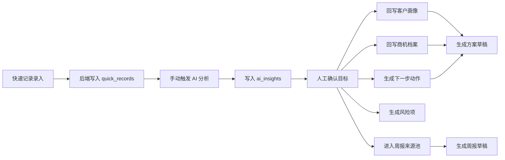

# 森特智行 AI 销售作战台功能完整性审计

审计日期：2026-06-06

## 审计结论

当前系统已经从纯前端原型推进到“React 前端 + Node 后端 + SQLite + WSL 部署脚本 + DeepSeek 后端模型接入”的可运行 MVP 底座。核心闭环中，快速记录、AI 结构化分析、人工确认、客户/商机回写、下一步动作、风险项、周报草稿和方案草稿已经具备真实后端写入与集成 QA 证据；真实 DeepSeek 连通性已用临时数据库验收，密钥只保留在后端 `.env`。

仍未完成的不是界面展示，而是更深的业务能力：权限与操作日志、附件/材料导出、管理视图后端聚合、风险延期/负责人分配和商机看板后端化。

## 需求覆盖矩阵

| 需求模块 | 当前状态 | 证据 | 下一步 |
| --- | --- | --- | --- |
| 战情总览 | 前端可用，读取后端客户/商机/动作；总览 KPI、优先动作、客户温度、节奏和阶段卡均可点击跳转 | `src/App.jsx` 后端 bootstrap；`Overview` 已填满桌面布局；集成 QA 覆盖卡片点击 | 后续接管理聚合 API |
| 客户画像 | 后端真实读写基础客户档案；前端支持新增与编辑；确认快速记录可回写画像 | `customers` 表；`GET/POST/PATCH /api/customers`；客户页 `CustomerEditor`；确认后更新 `syncPreview/needs/risks` | 联系人独立表和关系图增强 |
| 商机档案 | 后端真实读写基础商机；前端支持新增与编辑；确认快速记录可回写需求、风险、下一步 | `opportunities` 表；`GET/POST/PATCH /api/opportunities`；商机页 `OpportunityEditor`；确认后更新 `sourceRecord/risk/next` | 阶段拖拽、时间线后端化 |
| AI 沟通纪要 | 后端真实写入 quick record；已接 DeepSeek model 模式；具备 JSON 输出校验和安全降级 | `quick_records`、`ai_insights`；`POST /api/quick-records/:id/analyze`；`backend/src/modelAnalysis.js`；真实模型 smoke 返回 `source=deepseek` | 后续补调用日志和配额监控 |
| 下一步动作 | 后端真实生成和读取动作，可追溯来源 | `action_items`；`GET /api/actions`；确认后生成 `sourceRecordId` | 增加完成、延期、负责人分配 |
| 风险识别 | 后端风险表、诊断接口、快速记录确认生成风险、风险状态流转已闭环 | `risk_items`；`GET /api/risks`；`PATCH /api/risks/:id`；`POST /api/opportunities/:id/diagnose-risks`；风险页状态按钮 | 增加风险负责人、延期和管理视图聚合 |
| 方案辅助 | 后端可生成方案草稿，model 模式下走 DeepSeek；来源引用客户/商机/动作/知识库 | `solution_drafts`；`POST /api/solutions/draft`；`solutionDraft.sourceRefs` 包含 `knowledge`；后端测试验证模型调用 | 多模板输出、材料导出 |
| 周报自动生成 | 后端可从确认进入周报的记录生成草稿，model 模式下走 DeepSeek，并保留来源 | `weekly_reports`；`POST /api/reports/weekly/draft`；后端测试验证模型调用 | 增加编辑保存、Word/PDF 导出 |
| 销售知识库 | 后端真实入库、更新、检索；前端支持新增、编辑、搜索；方案草稿会引用匹配资料 | `knowledge_items`；`GET/POST/PATCH /api/knowledge`；`POST /api/knowledge/search`；`KnowledgeEditor` | 后续补附件上传、向量检索或全文检索 |
| 商机看板 | 前端展示完整，阶段来自静态看板数据 | `KanbanPage` 与静态 `kanbanStages` | 由后端 opportunities 阶段实时分组 |
| 管理汇报视图 | 已并入周报与总览展示，但后端聚合不足 | 周报草稿、总览卡片 | 增加管理汇总 API、预计回款和资源协调聚合 |
| WSL + 轻量数据库 | 已有 WSL service、full-stack production wrapper、SQLite 维护脚本 | `scripts/wsl-stack.mjs`、`backend/scripts/service.mjs`、`db-maintenance.mjs` | 后续补自动化部署文档和生产环境变量模板 |

## 本轮新增闭环

1. 新增共享合同实体 `riskItem`。
2. 新增 SQLite 表 `risk_items`，保存风险标题、分值、证据、建议动作、状态、来源。
3. 新增 `GET /api/risks` 风险列表接口。
4. 新增 `POST /api/opportunities/:id/diagnose-risks` 商机风险诊断接口。
5. 快速记录确认客户或商机后，后端会生成可追溯风险项，来源为 `sourceType=quick_record`。
6. 前端 bootstrap 加载后端风险；快速记录确认返回风险后，App 即时合并到风险页状态。
7. 集成 QA 增加风险页和 `/api/risks` 断言。

## 当前真实闭环

## 仍需主控拆分的工作包

| 优先级 | 工作包 | 说明 |
| --- | --- | --- |
| P0 | 真实模型调用与后端密钥隔离 | 已完成。当前业务 `.env` 为 `AI_ANALYSIS_MODE=model`，DeepSeek 连通性 smoke 已通过；测试环境固定 mock，避免消耗真实额度 |
| P1 | 周报编辑与导出 | 生成草稿后保存编辑版，导出 Word/PDF |
| P1 | 风险负责人和延期 | 在已完成状态流转基础上，增加负责人、延期原因、管理视图聚合 |
| P1 | 知识库增强 | 附件上传、资料版本、全文/向量检索、引用质量评分 |
| P2 | 权限与操作日志 | Admin/SalesManager/Sales/Presales/Viewer，所有 AI 和业务写入留痕 |
| P2 | 商机看板后端化 | 按 opportunity stage 动态分组，支持拖拽或阶段变更 |

## 2026-06-05 追加审计：模型适配层

本轮已补齐模型调用的后端隔离层：

1. `backend/src/modelAnalysis.js` 提供统一入口 `analyzeQuickRecord`。
2. 默认 `AI_ANALYSIS_MODE=mock`，保持现有可重复测试结果。
3. `AI_ANALYSIS_MODE=model` 且后端 `.env` 配置密钥时，后端调用 OpenAI-compatible chat completions。
4. 请求启用 JSON 输出模式，并校验 `customer/opportunity/weekly/summary` 结构。
5. 未配置密钥时返回 `source=mock_missing_model_key`；调用失败时返回 `source=mock_model_fallback`。
6. API 健康检查和分析响应不返回模型密钥。

剩余验收项：真实外部模型连通性需要在 WSL 后端 `.env` 配好正式密钥后单独跑，不应在前端、文档、截图或日志中暴露密钥。

## 2026-06-05 追加审计：客户/商机维护闭环

本轮已补齐客户和商机的新增、编辑、持久化闭环：

1. 后端新增 `PATCH /api/customers/:id` 和 `PATCH /api/opportunities/:id`。
2. 后端测试覆盖创建客户、编辑客户、创建商机、编辑商机，并用共享合同校验响应。
3. 前端 API 新增 `saveCustomer` 和 `saveOpportunity`，有 `id` 时走 PATCH，无 `id` 时走 POST。
4. 客户画像页新增 `CustomerEditor`，支持新增客户、保存当前客户、编辑需求/风险/基础架构等核心字段。
5. 商机档案页新增 `OpportunityEditor`，支持新增商机、保存当前商机、编辑阶段/赢率/需求/竞品/方案方向/风险/下一步。
6. 离线静态原型仍可本地保存，后端连接时写入 SQLite。
7. 集成 QA 已通过浏览器真实操作创建“测试集成客户”、编辑为“重点培育”、创建“测试集成客户规划调研”并编辑为“初步沟通”，再从后端列表验证记录存在。

## 2026-06-05 追加审计：品牌区、铺满布局与知识库闭环

本轮完成两类工作：界面顶部品牌区按用户新 logo 调整，业务侧补齐销售知识库后端闭环。

### UI 与响应式

1. 顶部品牌区只保留 `sent-zhixing-transparent-logo.png`，移除“森特智行 / AI 销售作战台”文字。
2. 导航专用 logo 已裁掉透明画布边距，避免在顶部被压缩成小图。
3. 外层窗口留白从原先约 18px 收紧到桌面不超过 10px，同时保留圆角边框。
4. 集成 QA 增加品牌区断言：品牌区文本必须为空，图片路径必须是新 logo。
5. 集成 QA 增加外层窗口 inset 断言，并继续覆盖 desktop/tablet/iPhone/android-small 的 `overflowX=0`。

### 知识库闭环

1. 新增共享合同实体 `knowledgeItem`。
2. 新增 SQLite 表 `knowledge_items`，字段包含标题、分类、标签、摘要、正文、来源和时间戳。
3. Seed 数据迁入四条基础知识：双活建设案例、移动云灾备对比清单、机房调研模板、AI 算力基础架构。
4. 新增 `GET /api/knowledge`、`POST /api/knowledge`、`PATCH /api/knowledge/:id`、`POST /api/knowledge/search`。
5. 前端 bootstrap 加载后端知识库，知识库页新增 `KnowledgeEditor`，支持新增、编辑、搜索。
6. 方案草稿生成会按客户、商机、需求、竞品和方案方向检索知识库，并在正文中输出“知识库引用”章节。
7. `solutionDraft.sourceRefs` 现在会保留 `knowledge` 来源引用。

### Fresh Result

- Frontend `npm run qa:local`: passed; secret scan covered 68 files.
- Frontend `npm run qa:integration`: passed and verified new logo-only brand area, compact outer shell inset, knowledge create/search through UI, solution draft knowledge citation, and four responsive viewports with `overflowX=0`.
- Backend Windows `npm test`: passed, 18/18.
- Root `npm run test:deploy`: passed, 8/8.
- Backend WSL `npm test`: passed, 18/18.
- Backend WSL `npm run smoke`: passed and returned health `status=ok`, `database=ready`, `aiAnalysisMode=mock`.
- WSL full-stack `npm run wsl:stack:start`、`npm run wsl:stack:health`、`npm run wsl:stack:stop`: all passed; backend `8897` and frontend `8088` health checks returned ok.

## 2026-06-06 追加审计：风险状态流转闭环

本轮把风险识别从“只展示风险”推进到“可人工确认、开始处理、关闭”的可操作流程。

### Backend

1. 新增 `PATCH /api/risks/:id`。
2. 风险状态限定为 `open`、`accepted`、`in_progress`、`closed`，非法状态返回 400。
3. PATCH 可同步更新处理建议 `action`、分值、严重度和色调，并刷新 `updated_at`。
4. 后端 API 测试覆盖风险诊断、状态更新到 `in_progress`、关闭到 `closed`、非法状态拒绝和列表持久化验证。

### Frontend

1. 前端 API 新增 `updateRiskStatus`，用共享合同校验 `riskItem`。
2. App 新增 `handleUpdateRiskStatus`，后端连接时写入 SQLite，离线原型时本地更新。
3. 风险页新增状态胶囊、状态指标和“确认风险 / 开始处理 / 关闭风险”按钮。
4. 集成 QA 在风险页真实点击“开始处理”和“关闭风险”，并断言页面显示“已关闭”。

### Fresh Result

- Frontend `npm run qa:local`: passed; API client tests 9/9; secret scan covered 68 files.
- Frontend `npm run qa:integration`: passed and verified risk status can be closed through the browser UI, plus existing quick-record/customer/opportunity/knowledge/weekly/solution flows and four responsive viewports with `overflowX=0`.
- Backend Windows `npm test`: passed, 19/19.
- Root `npm run test:deploy`: passed, 8/8.
- Backend WSL `npm test`: passed, 19/19.
- Backend WSL `npm run smoke`: passed with `status=ok`, `database=ready`, `aiAnalysisMode=mock`.
- WSL full-stack `npm run wsl:stack:start`、`npm run wsl:stack:health`、`npm run wsl:stack:stop`: all passed; backend `8897` and frontend `8088` health checks returned ok.

## 2026-06-06 追加审计：卡片联动与 DeepSeek 闭环

### 前端交互

1. 总览 KPI 卡片已可跳转到快速记录、商机档案、商机看板和风险页。
2. 今日优先动作卡片可进入动作详情。
3. 客户温度卡片可选中客户并进入客户画像。
4. 本日推进节奏卡片可进入方案、动作或周报模块。
5. 商机阶段分布卡片可进入商机看板。
6. 快速记录历史卡片可把记录内容载入录入区重新分析。
7. 周报每日卡片支持点击展开，保留七天记录的紧凑布局。
8. 基础信息卡、匹配卡支持点击展开上下文，避免详情模块只是静态展示。

### DeepSeek Model

1. `backend/src/modelAnalysis.js` 统一承接快速记录结构化分析、周报提炼和方案草稿生成。
2. 三类 AI 入口都使用 OpenAI-compatible `POST /chat/completions`，模型名为 `deepseek-v4-flash`。
3. `GET /api/health` 只暴露 `aiAnalysisMode`、`modelProvider`、`modelName`、`modelReady`，不暴露密钥。
4. 后端 `.env` 已用于业务运行环境；测试和集成 QA 显式使用 mock，避免自动化测试消耗真实模型额度。
5. 真实 DeepSeek 连通性 smoke 通过，快速记录分析返回 `source=deepseek`。
6. WSL 服务包装器不再默认强制 `AI_ANALYSIS_MODE=mock`，未显式覆盖时由后端 `.env` 接管正式模型配置。

### 安全与可用性

1. 新增根目录 `.gitignore`，忽略 `backend/.env`、SQLite 数据库、运行状态、构建产物和依赖目录。
2. 前端 secret scan 通过，未在前端、文档和公开产物中发现密钥模式。
3. DeepSeek 调用失败或无密钥时仍会安全降级到确定性 mock，前端流程不被外部模型故障阻断。
4. 周报和方案草稿继续保留 `sourceRefs`，保证数据来源可追溯。

### Fresh Result

- Backend Windows `npm test`: passed, 22/22.
- Backend WSL `npm test`: passed, 22/22.
- Backend WSL `npm run smoke`: passed with `aiAnalysisMode=model`, `modelProvider=deepseek`, `modelName=deepseek-v4-flash`, `modelReady=true`.
- Real DeepSeek smoke: passed with analysis `source=deepseek`.
- Frontend `npm run qa:local`: passed; secret scan covered 68 files.
- Frontend `npm run qa:integration`: passed and verified card navigation/expansion, quick-record writeback, risk closure, customer/opportunity editing, knowledge create/search, weekly/solution drafts, and desktop/tablet/iPhone/android-small `overflowX=0`.
- Root `npm run test:deploy`: passed, 8/8.
- WSL full-stack `npm run wsl:stack:start` and `npm run wsl:stack:health`: passed on backend `8897` and frontend `8088`, with backend `aiAnalysisMode=model` and `modelReady=true`.
